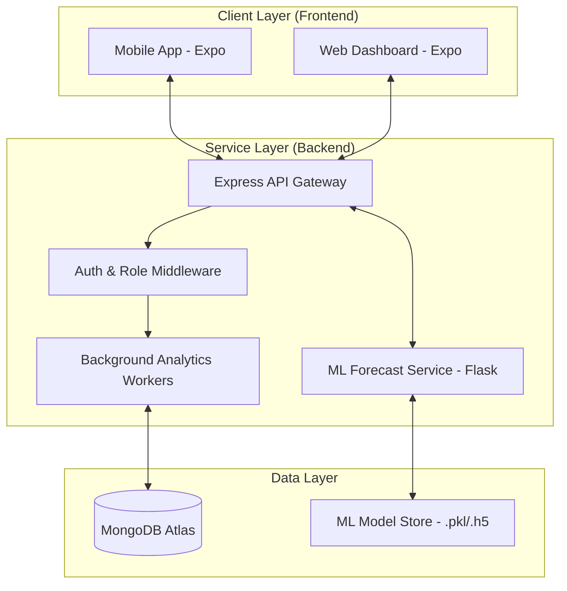

# Smart Cafeteria – Comprehensive Developer Guide

Welcome to the **Comprehensive Developer Guide** for the Smart Cafeteria Demand Forecasting and Token-Based Queue Optimisation System. This document serves as a central reference for Frontend, Backend, and Full-Stack developers.

---

## 1. Project Overview & Objectives

The **Smart Cafeteria** is an intelligent ecosystem designed to optimize food service operations through data-driven insights. 

**Key Objectives:**
- **Efficiency**: Reduce waiting times and overcrowding through token-based queue scheduling.
- **Sustainability**: Minimize food waste by forecasting meal demand using AI/ML models.
- **Transparency**: Provide real-time occupancy and wait-time dashboards for students and staff.
- **Data-Driven Planning**: Enable administrators to allocate resources based on peak-hour analytics.

---

## 2. Project Architecture

The system follows a distributed architecture consisting of a Mobile Frontend, a Node.js API Gateway, and a Python Machine Learning Service.



### Role Breakdown
- **Frontend Developer**: Focuses on the Client Layer (UI/UX, State Management, Navigation).
- **Backend Developer**: Focuses on the Service Layer (REST APIs, Database, Background Jobs, Security).
- **Full-Stack/Integration**: Manages the bridge between layers, including API communication and the ML service integration.

---

## 3. Technology Stack

| Layer | Technology |
| :--- | :--- |
| **Frontend** | React Native (Expo), React Navigation, Context API, Axios, Chart Kit |
| **Backend** | Node.js, Express.js, Mongoose ODM, JWT, bcryptjs |
| **ML Service** | **Python, Flask, XGBoost, TensorFlow, Pandas, Scikit-learn** |
| **Database** | MongoDB Atlas |
| **Dev Tools** | Nodemon, Git, Postman/Thunder Client |

---

## 4. Project Folder Structure

```text
smart-cafeteria/
│
├── frontend/                # React Native Mobile Application
│   ├── src/
│   │   ├── components/      # Common & Feature-specific UI
│   │   ├── screens/         # Organized by Student, Staff, Admin
│   │   ├── context/         # Auth & Global State management
│   │   ├── navigation/      # Stack & Tab based routing
│   │   └── services/        # Axios API service layer
│
├── backend/                 # API Server & Business Logic
│   ├── controllers/         # Logic for Auth, Booking, Crowd, Menu
│   ├── routes/              # API Endpoints mapping
│   ├── models/              # MongoDB/Mongoose Schemas
│   ├── services/            # Background Workers (Crowd Tracking, Alerts)
│   ├── utils/               # Token generation & Queue Managers
│   ├── ml_service/          # Python/Flask Machine Learning Hub
│   │   ├── app.py           # ML API Entry Point (Port 5001)
│   │   ├── models/          # Trained Model Binaries (XGBoost, LSTM)
│   │   └── data/            # Processed Datasets
│   └── server.js            # Node.js Application Entry Point (Port 5000)
│
└── QUICKSTART.md            # Rapid setup instructions
```

---

## 5. Setup & Installation

### Prerequisites
- Node.js (v16+) & Python (3.9+)
- MongoDB Atlas Account
- Expo Go App (for mobile testing)

### Role-Based Setup

#### **1. Backend & General Setup**
```bash
cd backend
npm install
# Configure .env with MONGODB_URI and JWT_SECRET
npm run seed  # Create admin & initial slots
npm run dev   # Start Node server on port 5000
```

#### **2. ML Service Setup (Full-Stack/Backend Roles)**
```bash
cd backend/ml_service
pip install -r requirements.txt
python app.py  # Start ML API on port 5001
```

#### **3. Frontend Setup**
```bash
cd frontend
npm install
# Set EXPO_PUBLIC_API_URL in .env to your Local IP
npx expo start
```

---

## 6. Key Features & Workflows

### 🛡️ User Authentication & RBAC
- **Student**: Booking, live crowd monitor, historical patterns.
- **Staff**: Queue management, peak-load alerts, serving speed recs.
- **Admin**: Menu management, user control, system-wide analytics.

### 📈 Crowd Monitoring & Forecasting
1. **Real-time Tracking**: `crowdTrackingService.js` takes snapshots every 2 minutes.
2. **Historical Analysis**: `crowdPredictionService.js` aggregates daily data at midnight.
3. **ML Forecasting**: The Python service provides daily/weekly demand predictions using XGBoost and LSTM models.

### 🌱 Sustainability & Fairness
- **Waste Reduction**: Demand forecasting allows cafeteria managers to prepare only what is needed.
- **Fair Allocation**: The token-based system ensures "First-In, First-Served" (FIFS) integrity.

---

## 7. API Reference (Core Endpoints)

| Endpoint | Method | Role | Description |
| :--- | :--- | :--- | :--- |
| `/api/auth/login` | POST | All | Secure JWT authentication |
| `/api/bookings` | POST | Student | Place meal booking & get token |
| `/api/crowd/current` | GET | All | Current cafeteria occupancy |
| `/api/forecast/daily` | GET | Admin | ML-driven 7-day demand forecast |
| `/api/staff/call-token`| POST | Staff | Advance the serving queue |

---

## 8. Contribution Guidelines

1. **Branching**: Use `feature/` or `fix/` prefixes for new branches.
2. **API Logic**: Always update the `api.js` service layer when adding backend routes.
3. **ML Updates**: When modifying models, run `python train.py` to update binaries in `ml_service/models/`.

---
*Note: This guide is a living document. For testing specifics, see `TESTING_GUIDE.md`.*
